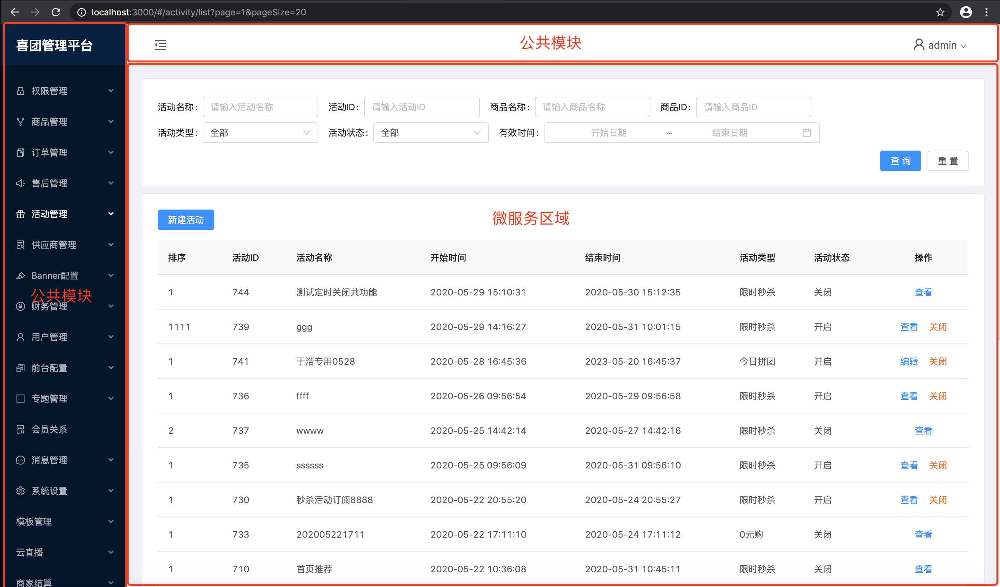
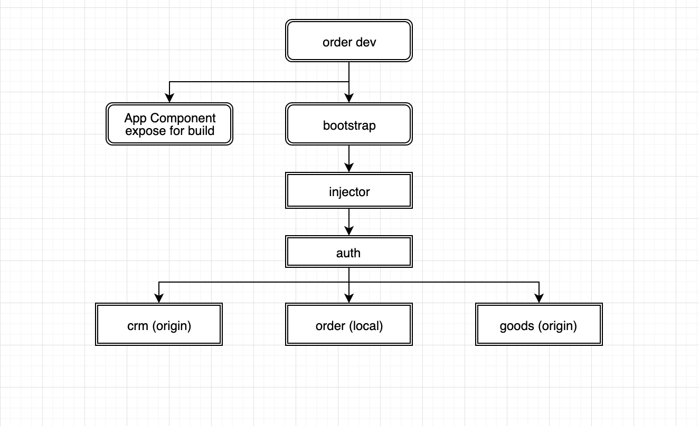
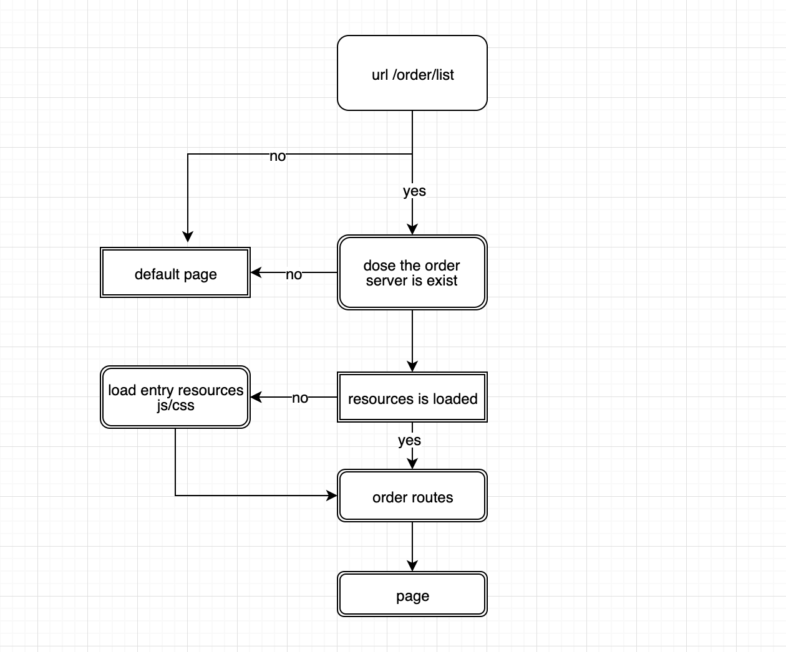

# crm微服务设计文档

# 示例


# 待拆组件
- 公共模块(login、header、left menu)
- order
- fresh
- crm其他模块
- ...

# bootstrap
render App \
const app = bootstrap(injectorConfig) \
app.mount(document.getElementById('root'))

injector \
根据当前路由加载子服务入口脚本，common是公共服务 \
配置如下
```
[
  {
    server: 'common',
    js: {
      src: [''],
      inject: 'body'
    },
    css: {
      src: [''],
      inject: 'haader'
    }
  },
  {
    server: 'crm',
    js: {
      src: [''],
      inject: 'body'
    },
    css: {
      src: [''],
      inject: 'haader'
    }
  },
  {
    server: 'order',
    js: {
      src: [''],
      inject: 'body'
    },
    css: {
      src: [''],
      inject: 'haader'
    }
  }
]
```

# 本地开发

bundle \
app.js -> server 服务入口 \
order.js -> expose 对外抛出的入口组件

使用`bootstrap`挂载, inject配置当前服务入口地址为localhost:3000/bundle.js


访问流程图


# 测试
example order服务更新 \
代码分支: `feature/issue100` \
order打包后的资源入口地址 `/order/issue100/bundle.js` \
主体服务 配置order服务的入口资源地址 代码分支: `feature/issue10`

访问域名 http://test-crmadmin.hzxituan.com/issue10/

